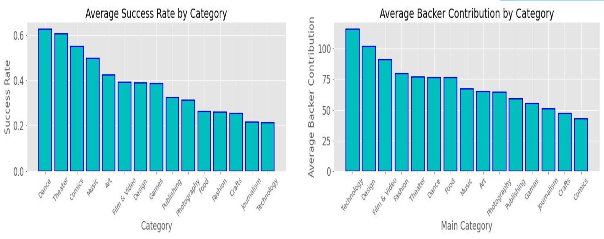

# kickstarter-project-success
**Benjamin Karlsberg**

## Project Description

Trying to create the most optimal model to predict if a Kickstarter project will succeed or fail based on pre-launch features

## Data

#### Source:

* Original dataset gathered from [Kaggle](https://www.kaggle.com/kemical/kickstarter-projects)
* Supplemented with information gathered from [Harvard Dataverse](https://dataverse.harvard.edu/dataset.xhtml?persistentId=doi:10.7910/DVN/EOYBXM) database

#### About Kickstarter:

Kickstarter.com is a crowd-funding website where anyone with a project idea can request pledge money from the public to finance their project concept. There is a low barrier to entry as it only requires a title, description, pledge tier rewards list, and a funding goal. The difficult part is the "All-or-Nothing" condition that Kickstarter has: funding can only be received if the target pledge goal is reached. Therefore, a successful project requires a careful balance of pledge goal and expected funding needed. The risk being that a failure to deliver after reaching the pledge goal can result in legal recourse.

## Exploratory Data Analysis

Upon first inspection of the Kaggle dataset I noticed that the data columns are very limited. I discovered the Harvard dataset which included the same projects over the same timeline (April 21st, 2009 through February 20th, 2018). I was able to extract several more pre-launch features by using PostgreSQL to combine the datasets. Both datasets included every project publically launched on kickstarter.com during this timeline (>35,000 total projects).

Although there were over 50 features in the combined dataset, only a few were able to be considered as pre-launch information for the projects. These included pledge goal, category, sub-category, currency, country, campaign duration, reward count, and description ("blurb").

A class imbalance exists in the dataset of 37% successful projects and 63% failed projects. Therefore, the baseline accuracy score being compared to is 63%.

When I compared the statistics of successful and failed projects there were a few obvious patterns. Projects that were successful tended to have much higher average backers and pledges, which might be attributed to a snowballing viral effect.

Also, the failed projects tended to have much higher goals which means that smaller projects had much better success rates.

It is also interesting to note which categories had the most successes vs the most backers. The artistic categories had much higher success rates but also much lower contributions per backer when compared to the more expensive categories like technology.

## Numerical Models

I decided to create separate models for numerical features and verbal features with the intention of creating a hybrid model at the end. The numerical models included every pre-launch category except for "Blurb," which was used for Natural Language Processing (NLP) in a separate model. Below are the accuracy, precision, and recall statistical scores for the 5 models that were tested using cross-validation with 80% of the total data.

## NLP Models ("Blurb")

The description of the project is one of the few pre-launch features that I had available to me so I used it to create a TF-IDF vector to perform NLP. The helpers.py file contains the preprocessor used to create the TF-IDF with lemmatiation and bigrams/trigrams. Below are the results of testing the 4 models that I tried.

## Hybrid Model From Best Performing Models

Using the best performing models from the Numerical and NLP modeling with the highest accuracy scores, I created a hybrid model that combined the predicted classification probabilities from both models as a new dataset. I tested the accuracy of combining them using a Decision Tree Classifier, a Random Forest Classifier, and a Logistic Regression. The Decision Tree had a final accuracy of 66.5%, the Random Forest had a score of 73.1%, and the Logistic Regression scored a 76.2%.

## Conclusion

Although the Gradient Boosted Classifier Feature Model only had an accuracy score of 73% and the Logistic Regression of the "Blurb" had an accuracy score of 68.3%, the combined model showed significant improvement when tested with a final score of 76.2%. This shows that there was some value to be had by utilizing the verbiage of the project description in determining success probability.

Although this project shows only about a 13.2% improvement from the baseline accuracy, it shows that there is potential for better predictions of a successful kickstarter launch if given more pre-launch data. Also, it could be used as a good guess-and-check for deciding an optimal pledge goal for future projects!

